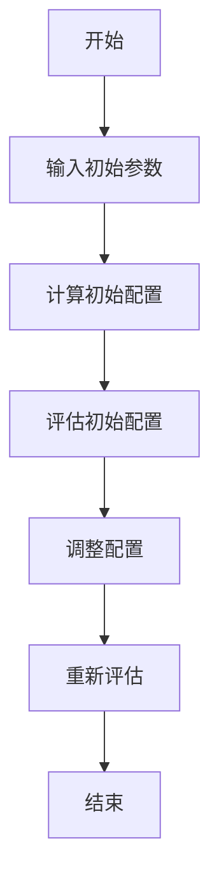

# 长宽比优化器

本模块专注于优化模具布局中各组件的长宽比，通过评估不同维度之间的比例关系来优化几何平衡性。

## 关键指标

1. 维度比例评估

   - 计算最长边与最短边比例
   - 评估中间边与最短边比例
   - 分析最长边与中间边比例

2. 极端比例处理
   - 识别不合理的长宽比
   - 评估极端情况影响
   - 应用惩罚机制调整

## 实现指南

1. 核心配置（`core/config.ts`）

   - 定义评分系数参数
   - 设置维度比例权重
   - 配置极端比例惩罚

2. 评分系统（`scoring/calculator.ts`）

   - 实现维度比例计算
   - 评估长宽比合理性
   - 计算综合几何得分

3. 优化策略（`optimizer.ts`）
   - 平衡各维度比例
   - 处理极端比例情况
   - 考虑实际加工约束

## 优化流程

### 1. 工作流程

### 2. 核心组件

1. **配置系统**

   - 种群大小：100
   - 最大迭代次数：500
   - 变异率：0.1
   - 精英比例：0.1
   - 收敛阈值：1e-6

2. **评分计算**

   - 维度比例得分计算
   - 奖励分数计算
   - 惩罚分数计算
   - 加权总分计算

3. **参数转换**
   - 扁平参数转换
   - 结构化配置生成

### 3. 执行过程

1. **初始化阶段**

   - 创建遗传算法优化器实例
   - 加载测试用例集
   - 初始化参数范围

2. **优化循环**

   - 评估当前种群适应度
   - 选择优秀个体
   - 执行交叉和变异操作
   - 检查收敛条件

3. **结果处理**
   - 获取最优参数集
   - 转换为配置对象
   - 计算最终评分
   - 生成优化报告

### 4. 关键工具类

- **ScoreCalculator**: 评分计算器
- **ParamConverter**: 参数转换器
- **ScoreReporter**: 报告生成器
- **RangeConverter**: 范围转换器

### 5. 优化维度

优化器关注三个核心维度的比例关系：

1. **最长边与最短边**

   - 阈值配置
   - 权重设置
   - 分数区间
   - 奖惩机制

2. **中间边与最短边**

   - 阈值配置
   - 权重设置
   - 分数区间
   - 奖惩机制

3. **最长边与中间边**
   - 阈值配置
   - 权重设置
   - 分数区间
   - 奖惩机制

## 使用示例
